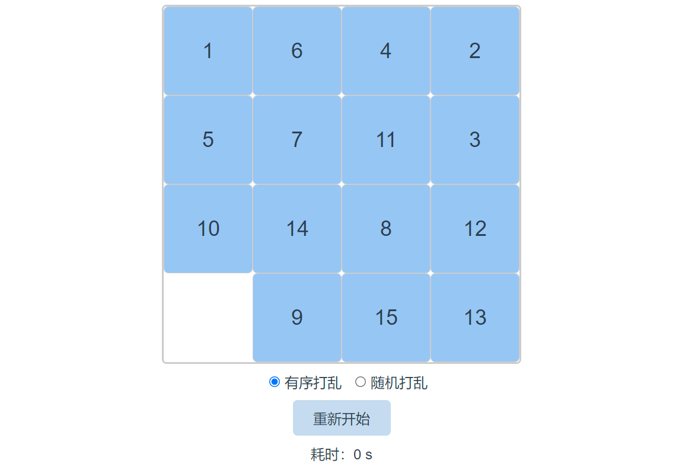

# vue-picture-puzzle

## 简介

基于vue.js实现的 4*4 拼图小游戏。[点击预览](https://gittig11.github.io/vue-picture-puzzle/) 

技术栈：
```
vue
vue-router
vuex
sass
babel
eslint
```

## 项目预览

 


## Project setup
```
yarn install
```

### Compiles and hot-reloads for development
```
yarn serve
```

### Compiles and minifies for production
```
yarn build
```

### Lints and fixes files
```
yarn lint
```

### Customize configuration
See [Configuration Reference](https://cli.vuejs.org/config/).
